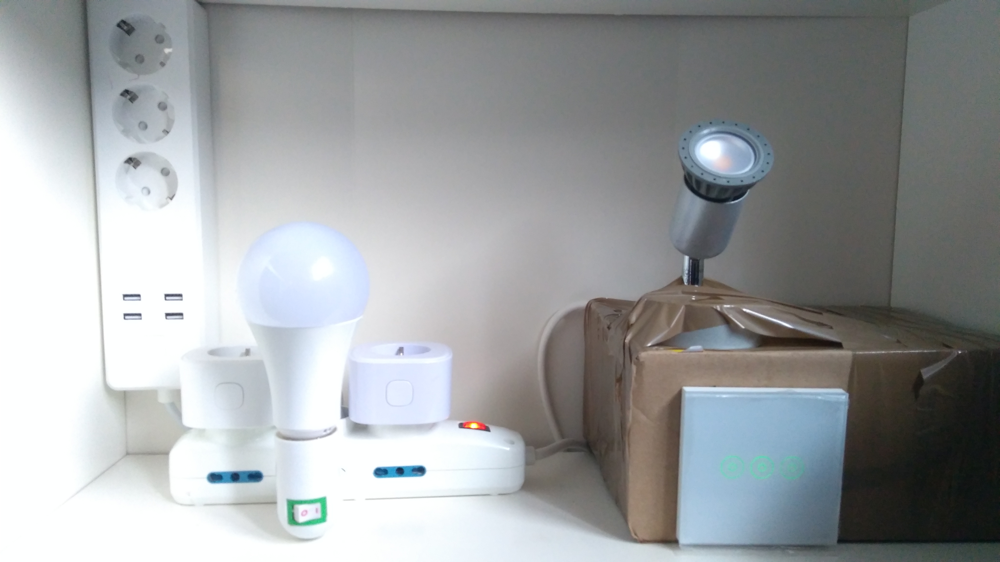

[](https://badge.fury.io/py/meross-iot)
[](https://pepy.tech/project/meross-iot)


# Meross IoT library
A pure-python based library providing API for controlling Meross IoT devices over the internet.

To see what devices are currently supported, checkout the *Currently supported devices* section.
However, some devices _might work as expected even if they are not listed_ among the supported devices.
In such cases, you're invited to open an issue and report tbe working/non-working status of your device.
This will help us to keep track of new devices and current support status of the library.

This library is still work in progress, therefore use it with caution.

## Requirements
This library requires __Python 3.7+__. Previous versions won't be supported by this library.
In case working with previous versions of python is mandatory for your project, consider using 0.3.X.X versions
of this library (although it's highly recommended to migrate to 0.4.X.X). 

## Installation
Due to the popularity of the library, I've decided to list it publicly on the Pipy index.
So, the installation is as simple as typing the following command:

```bash
pip install meross_iot==0.4.2.0
```

## Usage & Full Documentation
Refer to the [documentation pages](https://albertogeniola.github.io/MerossIot/) for detailed usage instructions,
or simply have a look at the `/examples` directory. 

If you are really impatient to use this library, refer to the following snippet of code that looks for a 
mss310 smart plug and turns it on/off.

```python
import asyncio
import os

from meross_iot.http_api import MerossHttpClient
from meross_iot.manager import MerossManager

EMAIL = os.environ.get('MEROSS_EMAIL') or "YOUR_MEROSS_CLOUD_EMAIL"
PASSWORD = os.environ.get('MEROSS_PASSWORD') or "YOUR_MEROSS_CLOUD_PASSWORD"


async def main():
    # Setup the HTTP client API from user-password
    http_api_client = await MerossHttpClient.async_from_user_password(email=EMAIL, password=PASSWORD)

    # Setup and start the device manager
    manager = MerossManager(http_client=http_api_client)
    await manager.async_init()

    # Retrieve all the MSS310 devices that are registered on this account
    await manager.async_device_discovery()
    plugs = manager.find_devices(device_type="mss310")

    if len(plugs) < 1:
        print("No MSS310 plugs found...")
    else:
        # Turn it on channel 0
        # Note that channel argument is optional for MSS310 as they only have one channel
        dev = plugs[0]

        # The first time we play with a device, we must update its status
        await dev.async_update()

        # We can now start playing with that
        print(f"Turning on {dev.name}...")
        await dev.async_turn_on(channel=0)
        print("Waiting a bit before turing it off")
        await asyncio.sleep(5)
        print(f"Turing off {dev.name}")
        await dev.async_turn_off(channel=0)

    # Close the manager and logout from http_api
    manager.close()
    await http_api_client.async_logout()


if __name__ == '__main__':
    # Windows and python 3.8 requires to set up a specific event_loop_policy.
    #  On Linux and MacOSX this is not necessary.
    if os.name == 'nt':
        asyncio.set_event_loop_policy(asyncio.WindowsSelectorEventLoopPolicy())
    loop = asyncio.get_event_loop()
    loop.run_until_complete(main())
    loop.close()
```


## Currently supported devices
Starting from v0.4.0.0, this library should support the majority of Meross devices on the market.
The list of tested devices is the following:
- MSL120 (RGB Bulb)
- MSS110 (Smart plug)
- MSS210 (Smart plug)
- MSS310 (Smart plug with power consumption)
- MSS310h (Smart plug with power consumption)
- MSS425E/MSS425F (Smart strip)
- MSS530H (Wall-mount switches)
- MSG100 (Garage opener)
- MSH300 (Smart hub + valve thermostat)
- MS100 (Smart hub + temperature/humidity sensor)
- MSS710
- MSXH0 (Smart Humidifier)

I'd like to thank all the people who contributed to the early stage of library development,
who stimulated me to continue the development and making this library support more devices.

Thanks to [DanoneKiD](https://github.com/DanoneKiD), 
[virtualdj](https://github.com/virtualdj), 
[ictes](https://github.com/ictes), 
[soberstadt](https://github.com/soberstadt), 
[ping-localhost](https://github.com/ping-localhost),
[tdippon](https://github.com/tdippon).

Special thanks go to the github sponsors supporting this and other projects. Thanks a lot!

## Unsupported device or feature?
In case you own a Meross Device that is not currently supported by this library, you may ask the developers to 
add specific support for that device. To do so, you will need to "sniff" low-level communication between your Meross
App and the specific device. Such data can help the developers to add support for that device.

Please [have a look at there](https://albertogeniola.github.io/MerossIot/advanced-topics.html#sniff-device-data) 
to discover how to use the Meross Sniffing tool to do so.   

## Homeassistant integration
Yeah, it happened. As soon as I started developing this library, I've discovered the HomeAssistant world.
Thus, I've decided to spend some time to develop a full featured Homeassistant custom component, that you find [here](https://github.com/albertogeniola/meross-homeassistant).
Thanks to @troykelly who made a wish and supported my efforts in developing such component!

## Running on OSX?
If so, please make sure you did install client certificates. [Follow instructions here](https://github.com/albertogeniola/MerossIot/issues/62#issuecomment-535769621).

## Donate!
I like reverse engineering and protocol inspection, I think it keeps your mind trained and healthy.
However, if you liked or appreciated by work, why don't you buy me a beer?
It would really motivate me to continue working on this repository to improve documentation, code and extend the supported meross devices.

Moreover, donations will make me raise money to spend on other Meross devices.
So far, I've bought the following devices:
- MSL120
- MSS210
- MSS310
- MSS425E
- MSS530H
- MSG100
- MSH300
- MSXH0

By issuing a donation, you will:
1. Give me the opportunity to buy new devices and support them in this library
1. Pay part of electricity bill used to keep running the plugs 24/7
(Note that they are used for Unit-Testing on the continuous integration engine when someone pushes a PR... I love DEVOPing!)  
1. You'll increase the quality of my coding sessions with free-beer!

[](https://www.buymeacoffee.com/albertogeniola)
[](https://github.com/sponsors/albertogeniola/dashboard/tiers)


### Look at these babies!

<p>
Look at the test environment that ensures high quality code of the library!
</p>

<p>When a pull-request is performed against this repository, a CI pipeline takes care of building the code,
testing it on Python 3.5/3.6/3.7, relying on some junit tests and, if all the tests pass as expected, the library
is released on Pypi. However, to ensure that the code <i>really works</i>,
the pipeline will issue on/off commands against real devices, that are dedicated 24/7 to the tests.
Such devices have been bought by myself (with contributions received by donators).
However, keeping such devices connected 24/7 has a cost, which I sustain happily due to the success of the library.
Anyways, feel free to contribute via donations!
</p>

## Changelog
#### 0.4.2.0
- Refactored MerossManager avoiding usage of multiple threads
- Implemented multiple mqtt connections to different servers
- Added custom API URL endpoint
- Merged #150 (Added MSS620 support)
- Added ErrorCode 1022
- Renamed MerossManager domain and port parameters
- Improved disconnection/reconnection event handling
- OnlineEvent is now being re-issued after client disconnection/reconnection
- Implemented disconnect/reconnect automatic test

<details>
    <summary>Older</summary>

#### 0.4.1.0rc8
- Implemented first roller_shutter support (merged #160), thanks to @adrigonzalvez 
#### 0.4.1.0rc7
- Implemented exponential backoff for api-rate limiter
- Fixed memory leakage that occurred for long-lived sessions of the MerossManager 
- Static known device types support added
- Returning newly discovery devices from the discovery method() 
- Implemented first version of meross_api_cli 
- Improved device state recover after connection drop
- Added API rate skip options
- Tuned API rate limiting defaults
- Fixed meross_sniffer utility not starting when ran from commandline
- Addressed problems with online events not being propagated correctly in some edge cases
- Fixed some known-cached types that were missing SystemOnline and SystemAll mixins 
- Removed warning logs from LightMixin when checking supported modes
#### 0.4.0.6
- Added device internal id parameter to async event handlers    
#### 0.4.0.5
- Implemented MQTT rate-limiter
- Updated documentation
- Fixed error occurring with paho-mqtt > 1.5.0
#### 0.4.0.3
- Improved sniffing data masking
- Added light.py update instruction
- Added error logs in case of missing async_update() call first call
#### 0.4.0.2
- Re-Implemented Meross Sniffer utility
#### 0.4.0.1
- Fixed #117
- Extended API error codes
- Updated paho-mqtt dependency to v1.5.0 
- Fixed errors caused in tests when running on windows system / Python 3.8
#### 0.4.0.0
Complete re-engineerization of the library.

- Asynchronous approach using asyncio
- Runtime ability discovery using runtime pluggable mixin architecture
- Dramatically increased performance using low-level asynchronous aiohttp and almost no locking primitive
- Added full-featured documentation
- Added python type hints
- Moved CI/CD to GitHub pages for letting PR test with on-premise Meross devices 
#### 0.3.4.0RC
- Added HTTP API logout capability
- Refactored MerossManager/HTTPClient classes
#### 0.3.3.3
- Added lock-assistant capability to help debug deadlock cases
- Improved tests
#### 0.3.3.0
- Added auto-reconnection capabilities by default
- Improved automated testing skipping
#### 0.3.2.22
- Fixed MerossManager not being thread-safe
#### 0.3.2.21
- Fixed status integer not being parsed as INT
#### 0.3.2.20 
- Merged PR that adds supports for humidity sensor
### 0.3.2.17
- Added Offline event emulation
### 0.3.2.15
- Fixed deadlock occurring when handling Thermostat
- Implementing callback/timeouts
### 0.3.2.14
- Added option to force status-update on devices
- get_sys_data now ignores online status in order to allow full status update (including online status)
### 0.3.2.12
- Hotfix for introduced regression
- Minor fix for power_plugs
### 0.3.2.9
- Implemented battery stats fetch for HUB devices (valve)
### 0.3.2.7
- Added support for smart humidifier
### 0.3.2.6
- Added support for binding/unbinding events    
### 0.3.2.5
- Fixed set_target_temperature not working as intended
### 0.3.2.4
- Improved thermostat support
- New handling of Hub and subdevices
- General refactor    
### 0.3.1.12
- Implemented meross_sniffer tool for collecting unknown devices logs
### 0.3.1.11
- Implemented meross_info_gather script
### 0.3.1.10
- Improved logging
### 0.3.1.9
- Fixed missing method implementation
- Improved logging
- Minor improvements __str__ methods
### 0.3.1.8
- Added HUB + thermostat support
### 0.3.1.6
- Improved light bulb driver (capacity)
### 0.3.1.5
- Fixed wrong MerossEventType being advertised for DeviceDoorStatusEvent
### 0.3.1.3
- Added event fire capability to GenericBulb class.
- Fixed bulb state kwargs bug
- Improved set_light_color function for bulbs
### 0.3.0.2
- Fixed door closing checks when using the async + callback close() and open() methods.
### 0.3.0.1
- Added get_power_consumption() and get_electricity() methods as abstract methods of AbstractMerossDevice
- Fixed regression passing manager parameter when firing Meross events.
### 0.3.0.0rc4
- Added added switch_state to the generated event
### 0.3.0.0rc3
- Added quick fix for MSS560 color control
### 0.3.0.0rc2
- Fixed Major bugs with MSG100
- Updated README examples
### 0.3.0.0rc1
- Added MSG100 support
- Fixed errors being logged when power consumptionX command was issued on powerplugs
### 0.3.0.0b1
- General refactor of the library
- Added event-based support
- Fixed default mqtt broker address for non-european devices
### 0.2.2.1
- Added basic bulb support: turning on/off and light control
- Implemented MSL120 support
- Implemented MSL120 automatic test
- Extended example script usage to show how to control the light bulbs
- Added maximum retry limit for execute_command and connect()
### 0.2.1.1
- Code refactoring to support heterogeneous devices (bulbs, plugs, garage openers)
### 0.2.1.0
- Implemented auto-reconnect on lost connection
- Improving locking system in order to prevent library hangs when no ack is received

</details>
