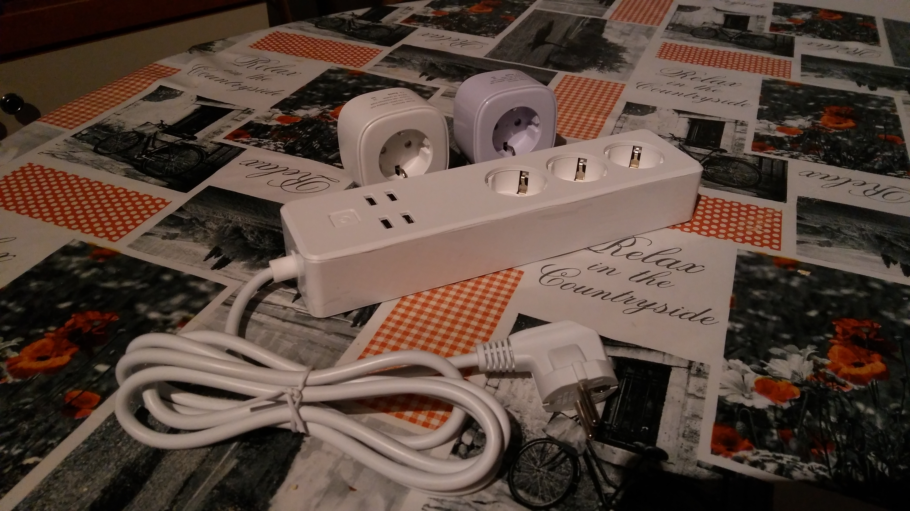
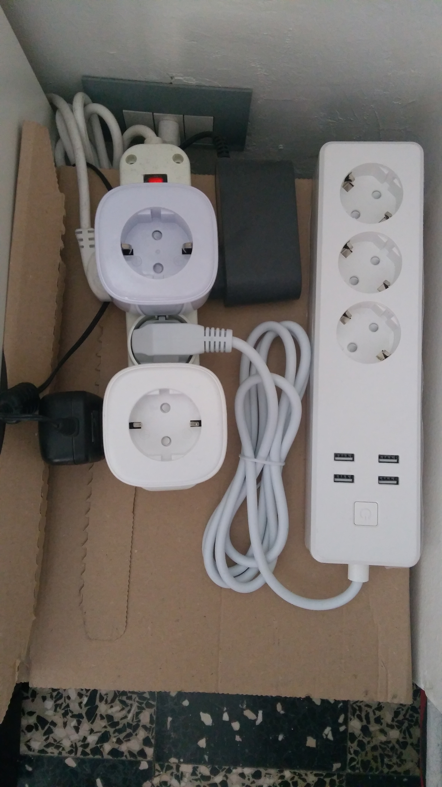

[](https://albertogeniola.visualstudio.com/Meross/_build/latest?definitionId=1)


# Meross IoT library
A pure-python based library providing API for controlling Meross IoT devices over the internet.

To see what devices are currently supported, checkout the *Currently supported devices* section. 
Hopefully, more Meross hardware will be supported in the future.

This library is still work in progress, therefore use it with caution.

## Installation
Due to the popularity of the library, I've decided to list it publicly on the Pipy index.
So, the installation is as simple as typing the following command:

```
pip install meross_iot --upgrade
```

## Usage
The following script demonstrates how to use this library.

```python
from meross_iot.api import MerossHttpClient

if __name__=='__main__':
    httpHandler = MerossHttpClient(email="YOUR_MEROSS_CLOUD_EMAIL", password="YOUR_PASSWORD")

    print("Listing online devices...")

    # Retrieves the list of supported and ONLINE devices.
    # If you also want to list offline devices, pass the online_only=False parameter.
    # Note! Trying to control an offline device will generate an exception.
    devices = httpHandler.list_supported_devices()
    for d in devices:
        print("-", d)

    for device in devices:
        print("\n-------------------------------\n"
              "Playing with device: %s"
              "\n-------------------------------" % device)

        # Returns most of the info about the power plug
        print("\nGetting system data...")
        data = device.get_sys_data()
        print(data)

        # If the device supports multiple channels, let's play with each one.
        n_channels = len(device.get_channels())
        print("The device supports %d channels" % n_channels)

        for channel in range(0, n_channels):
            # Turns the power-plug on
            print("\nTurning channel %d on..." % channel)
            device.turn_on_channel(channel)

            # Turns the power-plug off
            print("Turning channel %d off..." % channel)
            device.turn_off_channel(channel)

        # Some devices also have a dedicated channel for USB
        usb_channel_index = device.get_usb_channel_index()
        if usb_channel_index is not None:
            # Turns the USB on
            print("\nTurning on USB...")
            device.turn_on_channel(usb_channel_index)

            # Turns the power-plug off
            print("Turning off USB...")
            device.turn_off_channel(usb_channel_index)

        # Some devices support reading consumption data
        if device.supports_consumption_reading():
            print("\nReading consumption data...")
            consumption = device.get_power_consumption()
            print(consumption)

        # Some devices support reading consumption data
        if device.supports_electricity_reading():
            print("\nReading electricity data...")
            electricity = device.get_electricity()
            print(electricity)

        # Returns the list of WIFI Network available for the plug
        # (Note. this takes some time to complete)
        print("\nScanning Wifi...")
        wifi_list = device.get_wifi_list()
        print(wifi_list)

```

## Currently supported devices
Starting from v0.2.0.0, this library should support the majority of Meross devices on the market.
The list of tested devices is the following:
- MSS110
- MSS210
- MSS310
- MSS310h
- MSS425e

I'd like to thank all the people who contributed to the early stage of library development,
who stimulated me to continue the development and making this library support more devices:

Thanks to [DanoneKiD](https://github.com/DanoneKiD), [virtualdj](https://github.com/virtualdj), [ictes](https://github.com/ictes), [soberstadt](https://github.com/soberstadt), [ping-localhost](https://github.com/ping-localhost).

## Protocol details
This library was implemented by reverse-engineering the network communications between the plug and the meross network.
Anyone can do the same by simply installing a Man-In-The-Middle proxy and routing the ssl traffic of an Android emulator through the sniffer.

If you want to understand how the Meross protocol works, [have a look at the Wiki](https://github.com/albertogeniola/MerossIot/wiki). Be aware: this is still work in progress, so some pages of the wiki might still be blank/under construction.

## Donate!
I like reverse engineering and protocol inspection, I think it keeps your mind trained and healthy. 
However, if you liked or appreciated by work, why don't you buy me a beer? 
It would really motivate me to continue working on this repository to improve documentation, code and extend the supported meross devices.


Moreover, donations will make me raise money to spend on other Meross devices. 
So far, I've bought the following devices:
- MSS210
- MSS310
- MSS425E

By issuing a donation, you will:
1. Give me the opportunity to buy new devices and support them in this library
1. Pay part of electricity bill used to keep running the plugs 24/7 
(Note that they are used for Unit-Testing on the continuous integration engine when someone pushes a PR... I love DEVOPing!)  
1. You'll increase the quality of my coding sessions with free-beer!

[](https://www.paypal.com/cgi-bin/webscr?cmd=_s-xclick&hosted_button_id=6HPAB89UYSZF2)


Look at these babies!




